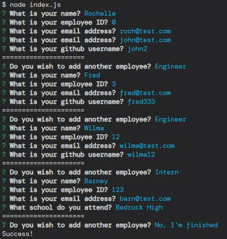
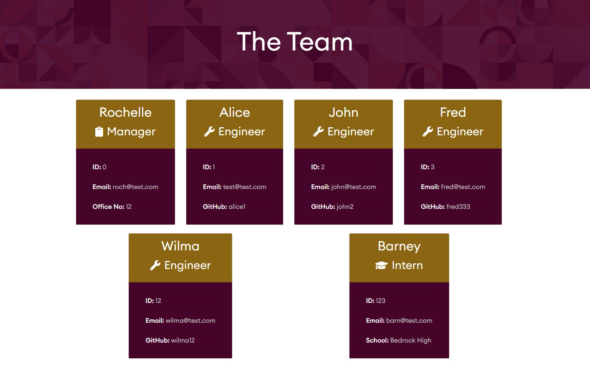
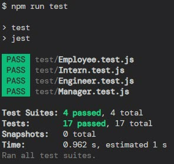

# Team Profile Generator

 
## Table of Contents
- [Team Profile Generator](#team-profile-generator)
  - [Table of Contents](#table-of-contents)
  - [Description](#description)
    - [User Story](#user-story)
    - [Acceptance Criteria](#acceptance-criteria)
  - [Installation](#installation)
  - [Usage](#usage)
  - [Tests](#tests)
  - [Questions](#questions)
  - [License](#license)
## Description
The task this week was to create a command line application, that would generate a team profile using JavaScript and Node.js. We were provided with some start code such as the page template and the tests created with Jest. Below you can view the user story and the acceptance criteria.
### User Story
```
AS A manager
I WANT to generate a webpage that displays my team's basic info
SO THAT I have quick access to their emails and GitHub profiles
```
### Acceptance Criteria
- Create a command-line application that accepts user input using the provided starter code.
- Create classes for each team member provided and export them. The tests for these classes, which are located in the `_tests_` directory, must ALL pass.
- The first class is an `Employee` parent class with the following properties and methods:
  - `name`
  - `id`
  - `email`
  - `getName()`
  - `getId()`
  - `getEmail()`
  - `getRole()` —returns `'Employee'`
- The other three classes will extend Employee.
- In addition to `Employee's` properties and methods, `Manager` will also have the following:
  - `officeNumber`
  - `getRole()` —overridden to return `'Manager'`
- In addition to `Employee's` properties and methods, `Engineer` will also have the following:
  - `github` —GitHub username
  - `getGithub()`
  - `getRole()` —overridden to return `'Engineer'`
- In addition to `Employee's` properties and methods, `Intern` will also have the following:
  - `school`
  - `getSchool()`
  - `getRole()` —overridden to return `'Intern'`
- Finally, although it’s not a requirement, consider adding validation to ensure that user input is in the proper format.
- Write code in `index.js` that uses Inquirer to gather information about the development team members and creates objects for each team member using the correct classes as blueprints.
- When a user starts the application, they're prompted to enter the **team manager's**:
  - Name
  - Employee ID
  - Email address
  - Office number
- When a user enters those requirements, the user is presented with a menu with the option to:
  - Add an engineer
  - Add an intern
  - Finish building the team
- When a user selects the engineer option, the user is prompted to enter the following and then taken back to the menu:
  - Engineer's Name
  - ID
  - Email
  - GitHub username
- When a user selects the intern option, the user is prompted to enter the following and then taken back to the menu:
  - Intern’s name
  - ID
  - Email
  - School
- When a user decides to finish building their team, they exit the application and the HTML is generated.
- Call the `render` function (provided for you) and pass in an array containing all employee objects.
- The `render` function will generate and return a block of HTML including templated `div` elements for each employee.
- Create an HTML file using the HTML returned from the `render` function.
- Write it to a file named `team.html` in the `output` folder.
- You can use the provided variable `outputPath` to target this location.
## Installation
Clone the GitHub repo into your working directory. 
In order to install the dependencies in the package.json file, run the command `npm install`. Alternatively you can install the packages individually

- Node.js - found here [https://nodejs.org/en/](https://nodejs.org/en/)
- Inquirer `npm install --save inquirer@^8.0.0`
- Jest - `npm install --save-dev jest`
  
## Usage 
In order to start the command line application you will need to use the following command: `node index.js`

You will be required to fill out the Manage information, once complete you can then add as many Engineers and Interns as required. 



When you have finished building your team - when asked if you'd like to add another employee, select "No I'm Finished" and the HTML page will be generated. See the below image:



You can find the generated HTML page in the 'output' folder.

Please see the below video for reference:

https://drive.google.com/file/d/10ffb3tbY55JTXc9k_Hp66l9OyWGU7mG7/view?usp=share_link
  
## Tests
This project uses Jest to run a series of tests to ensure all classes are working correctly. If making any changes please run the tests to ensure that they're still passing as expected. See below image for reference:



Enter the command `npm run test` to trigger the test run. 
  
## Questions
For any questions or further information please get in touch via GitHub or email

GitHub - [https://github.com/rbrd87](https://github.com/rbrd87)

Email - [rochellembradley@gmail.com](mailto:rochellembradley@gmail.com)

## License 
This project is licensed under the terms of [MIT License ](../LICENSE)
